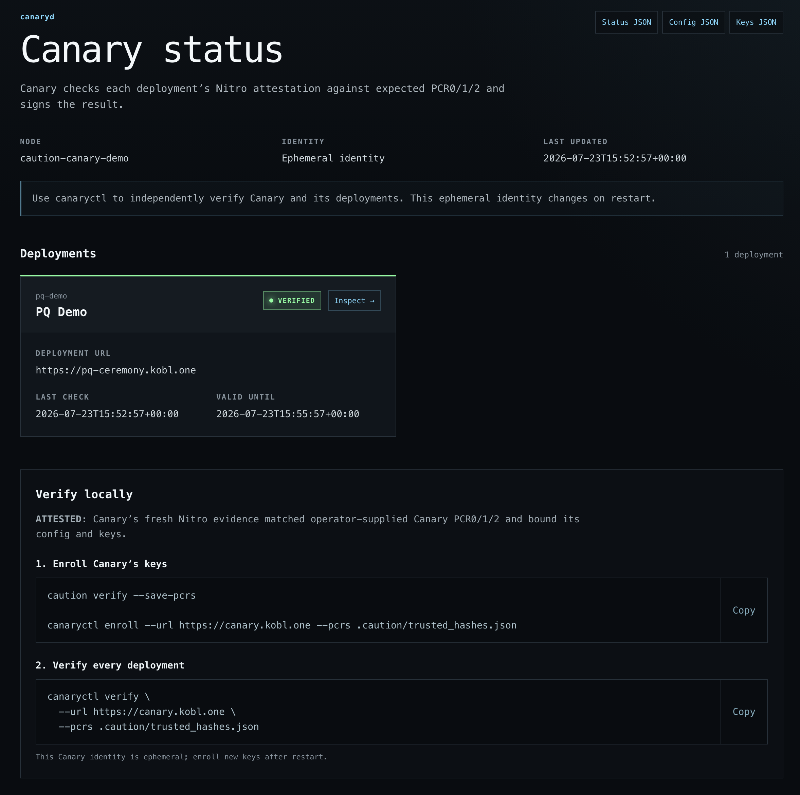
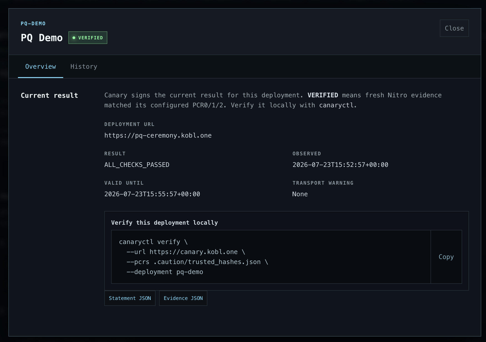
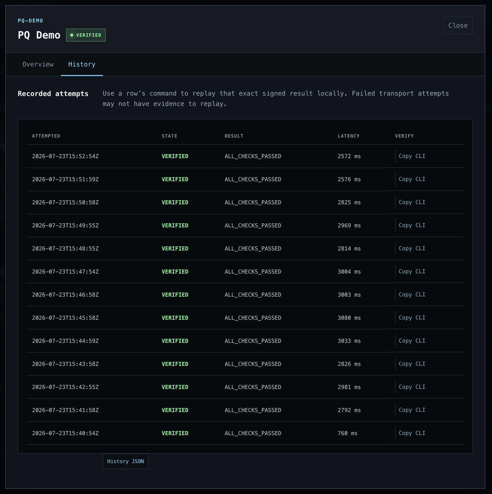

# Caution Canary

Canary continuously checks public Caution/Bootproof attestation endpoints. For each
deployment, it fetches fresh nonce-bound Nitro evidence, compares PCR0/1/2 with the
policy you supplied, and publishes a short-lived result signed with Ed25519 and
ML-DSA-65.

`canaryctl` independently verifies the Canary trust input, both signatures, and the
linked Nitro evidence. A `VERIFIED` deployment means its most recent fresh evidence
matched its configured PCR0/1/2. It does not prove application correctness, traffic
routing, or coverage of replicas that are not configured separately.

## Quick start

### 1. Install `canaryctl`

```sh
cargo build --release --locked -p canaryctl
export PATH="$PWD/target/release:$PATH"
```

You need a public HTTPS Bootproof `/attestation` endpoint for each deployment. Local
use additionally needs Docker with BuildKit and linux/amd64 support.

### 2. Add a deployment

Preferred: reproduce the deployment with Caution and save its PCRs before adding it:

```sh
caution verify \
  --attestation-url https://payments.example.com/attestation \
  --save-pcrs

canaryctl deployment add \
  --config canary.json \
  --canary-id company-canary \
  --id payments-prod \
  --name "Payments production" \
  --url https://payments.example.com/attestation \
  --pcrs .caution/trusted_hashes.json
```

`--canary-id` is required only when creating `canary.json`. Add each further
deployment with a unique ID; use `--replace` to change an existing one.

For a local evaluation, use explicit deployment TOFU instead:

```sh
canaryctl deployment add \
  --config canary.json \
  --canary-id company-canary \
  --id payments-prod \
  --name "Payments production" \
  --url https://payments.example.com/attestation \
  --tofu
```

TOFU verifies fresh Nitro evidence before displaying candidate PCRs, but it does not
show that those PCRs came from reviewed or independently reproduced source. Confirm
the values carefully; scripted use requires explicit `--accept-tofu`.

### 3. Run Canary

For local development, create a signing seed and run the local image:

```sh
canaryctl identity create --env-file .env

docker buildx build \
  --load \
  --platform linux/amd64 \
  --target local \
  --tag caution-canary:local \
  --file Containerfile \
  .

docker run --rm --platform linux/amd64 \
  --publish 127.0.0.1:8080:8080 \
  --env-file .env \
  --volume "$PWD/canary.json:/app/canary.json:ro" \
  caution-canary:local
```

Never commit `.env`; it contains the root signing seed. Local history is discarded
when the container stops.

For a Caution deployment, copy `caution.hcl.template` to `caution.hcl`, set its public
source URL and HTTPS domain, then choose one identity mode:

- **Ephemeral:** set `args = ["--ephemeral-identity"]` for a disposable monitor.
  A restart creates a new signing keyset.
- **Stable:** keep the `env::vault("CANARY_MASTER_SEED")` block and prepare the
  encrypted seed:

  ```sh
  canaryctl identity create --env-file .env
  caution secret keygen canary.asc \
    --name "Canary POC" --email canary@example.com --shoot-self-in-foot
  export KEYMAKER_URL=https://keymaker.example.com
  caution secret new canary.asc --threshold 1 --max 1
  caution secret encrypt --env-file .env CANARY_MASTER_SEED
  ```

  This 1-of-1 key is for evaluation only. Use separate protected shard holders in
  production.

Initialize after selecting the identity mode. Commit `canary.json`, `caution.hcl`,
deployment metadata, and—only in stable mode—the public quorum bundle and encrypted
seed. Never commit `.env` or `canary.private.asc`.

```sh
caution init
git add canary.json caution.hcl .caution/deployment.json
# Stable mode only:
git add .caution/quorum-bundle.json .caution/secrets/CANARY_MASTER_SEED.asc
git commit -m "Configure Canary deployment"
git push caution main
caution verify --save-pcrs
```

In stable mode, release the seed only after verification:

```sh
caution secret send-shard --keyring canary.private.asc
```

The stable signing keyset survives restarts. An ephemeral Canary creates a new keyset
and must be enrolled again after every restart.

### 4. Enroll Canary, then verify deployments

For Caution, enroll Canary's attested public keys once:

```sh
canaryctl enroll \
  --url https://canary.example.com \
  --pcrs .caution/trusted_hashes.json \
  --keys canary-keys.json

canaryctl verify \
  --url https://canary.example.com \
  --pcrs .caution/trusted_hashes.json \
  --keys canary-keys.json
```

Keep `canary-keys.json` as an integrity-critical public trust file. Enrollment never
overwrites it. Select specific deployments with repeated `--deployment payments-prod`.

The local Docker flow has no Canary attestation. Pin its first observed keyset only
with the explicit local TOFU mode:

```sh
canaryctl enroll \
  --url http://localhost:8080 \
  --insecure \
  --keys canary-keys.json

canaryctl verify \
  --url http://localhost:8080 \
  --insecure \
  --keys canary-keys.json
```

`--insecure` skips Canary's own attestation. It still pins Canary's keys and checks
both signatures on every result. For a `VERIFIED` result it also checks the linked
deployment Nitro evidence and PCR0/1/2. It does not authenticate the original Canary
identity or configured deployment policy.

## Per-target webhook watcher

Run the external watcher when different Canary targets need different notification
routes:

```sh
cp canary-watch.example.json canary-watch.json
export PQ_WEBHOOK_SECRET="$(openssl rand -base64 32)"
canaryctl watch --config canary-watch.json --insecure
```

Each target can fan out to multiple webhooks. The watcher performs the same complete
live verification as `canaryctl verify` before sending a target event; it does not
probe target attestation endpoints itself. It also sends signed heartbeats and
Canary-wide outage or trust-failure events. Webhook secrets are base64-encoded
32-byte HMAC keys loaded from the named environment variables and never belong in
the config file. On a normal host, inject them with its secret manager. If the
watcher is deployed as its own Caution application, expose each name through
`env::vault(...)` and protect the encrypted values with Locksmith; this does not
change the Canary deployment.

`canary-watch.json` is deliberately separate from measured `canary.json`, so changing
alert routing does not rebuild the Canary enclave. Relative PCR and key paths resolve
from the watcher config's directory. Restart the watcher after editing its config.
For local testing, pass `--insecure` to allow HTTP webhook URLs. If the Canary itself
is local and uses HTTP, also omit `canary.pcrs`; the same flag then skips Canary's own
attestation. `--insecure` must not be used in production.

Every POST contains `schema_version`, `event`, `event_id`, `timestamp`, `canary`, and
`data`. Verify the receiver-facing headers against the exact request body:

- `X-Canary-Event-Id`
- `X-Canary-Timestamp`
- `X-Canary-Signature: v1=<hex HMAC-SHA256(timestamp + "." + body)>`

Retries reuse the same event ID, timestamp, body, and signature. Target events are
`target.status_changed`, `target.read_failed`, and `target.read_recovered`; watcher
events are `canary.unavailable`, `canary.verification_failed`, `canary.recovered`,
and `watcher.heartbeat`.

## Web UI

Open `https://canary.example.com/` (or `http://localhost:8080/` locally) for current
status. Each deployment has a compact overview and history view with ready-to-copy
local `canaryctl verify` commands. Statement, evidence, and history JSON remain
available as secondary inspection artifacts.







The home-page self-check reports whether `/dev/nsm` is visible, scheduler readiness,
identity lifecycle, and the running binary/config digests. That environment result is
a self-reported runtime hint, not remote proof. Run `canaryctl` with your own PCR and
key inputs to verify fresh Canary attestation and its config/key bindings externally.

## Advanced checks

Replay one retained attempt for one deployment:

```sh
canaryctl verify \
  --url https://canary.example.com \
  --pcrs .caution/trusted_hashes.json \
  --keys canary-keys.json \
  --deployment payments-prod \
  --attempt 42
```

Download and inspect a protocol artifact only when needed for debugging or evaluation:

```sh
curl -fsS https://canary.example.com/targets/payments-prod/statement -o statement.json
curl -fsS https://canary.example.com/targets/payments-prod/evidence -o evidence.json

canaryctl artifact verify-statement \
  --statement statement.json \
  --keys canary-keys.json

canaryctl artifact verify-evidence \
  --evidence evidence.json \
  --pcrs .caution/trusted_hashes.json
```

These are partial checks. Use `canaryctl verify` for the complete current or
historical verification path. `--verbose` shows detailed chain diagnostics; `--json`
emits one machine-readable result.

## Practical trust limits

- Expected deployment PCRs are an operator-supplied policy. TOFU establishes
  continuity, not source reproduction.
- Every result requires Ed25519 and ML-DSA-65 signatures. Nitro's upstream attestation
  chain remains AWS-rooted and classical.
- Deployment names, URLs, PCRs, keys, statements, evidence, and metadata are public.
- History is enclave/container-local and is not a durable audit log.
- Canary has no application-traffic binding, automatic replica discovery, or
  application-correctness proof.

For the protocol and exact security requirements, see
[the V0 specification](docs/canary-v0-spec.md).

## License

This workspace is licensed under `AGPL-3.0-only`; see [LICENSE.md](LICENSE.md).
