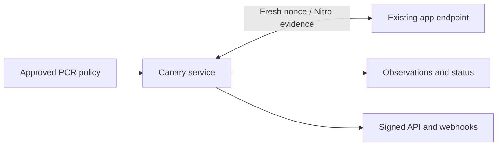

# Caution Canary V0 — Standalone Service Specification

## Goal

Build the smallest useful version of Canary **without changing STEVE, Bootproof, customer applications, the deployment builder or the Reproducer**.

Canary V0 periodically challenges the existing `/attestation` endpoint, validates the returned AWS Nitro evidence against customer-approved PCRs, records the observation, exposes a signed queryable status, and sends generic webhooks when that status changes.

The precise V0 claim is:

> At the stated observation time, this registered endpoint returned fresh, valid AWS Nitro evidence matching the PCR policy supplied to Caution.

V0 does **not** claim that the PCRs were independently reproduced from source, that normal application traffic reached the same enclave, or that the approved code is safe.

## User flow

1. The customer obtains trusted PCRs independently—for example from a local reproduction and `caution verify --save-pcrs`.
2. The customer registers a target with Canary using an API or minimal admin form:
   - Application name and stable ID
   - Attestation URL
   - Expected PCR0, PCR1 and PCR2
   - Check interval and result TTL
   - Public/private status setting
   - Optional webhook URL and secret
3. Canary treats the authenticated registration as approval of policy version 1.
4. Canary begins challenging the existing endpoint.
5. The customer or a widget queries the current signed status.
6. Canary sends a webhook only when the aggregate status changes.

Changing expected PCRs creates a new immutable policy version with an audit record; it never silently edits the existing policy.

## Architecture



V0 is one standalone service containing:

- An authenticated management API
- A simple background scheduler and verification worker
- The existing `bootproof-sdk` verification logic
- PostgreSQL for policies, observations and webhook delivery state
- A signing key for public status statements

It deploys as one container plus PostgreSQL. The API and worker may live in the same process initially. No message queue, consensus mechanism, separate frontend or multi-region coordination is required.

## Target policy

```json
{
  "target_id": "app_01",
  "name": "Project Eleven production",
  "attestation_url": "https://app.example.com/attestation",
  "expected_pcrs": {
    "0": "...",
    "1": "...",
    "2": "..."
  },
  "interval_seconds": 60,
  "result_ttl_seconds": 180,
  "public_status": true,
  "policy_version": 1
}
```

The policy also records its creator, creation time and a canonical digest. Source URL, commit and manifest digest may be stored as descriptive metadata, but V0 must not present them as independently verified.

Canary never derives expected PCRs from the live endpoint or its returned manifest. The monitored system cannot define the policy against which it is judged.

## Verification loop

For every enabled target, Canary:

1. Generates a fresh random 32-byte nonce.
2. Sends `POST {"nonce":"<base64>"}` to the configured `/attestation` URL.
3. Rejects redirects, oversized responses and responses received after the timeout.
4. Extracts the existing `document` or `attestation_document` field.
5. Validates:
   - AWS Nitro certificate chain and certificate validity
   - COSE signature
   - Exact nonce equality
   - Presence of PCR0, PCR1 and PCR2
   - Non-debug PCR values
   - Exact equality with the active policy
6. Records the outcome, latency, observed PCRs, Nitro timestamp, hashed `module_id`, evidence digest and policy digest.
7. Recalculates target status and emits a signed status statement.
8. Sends a webhook if the aggregate status changed.

The response manifest is not trusted as policy. V0 may hash it for diagnostics but does not need to store or interpret it.

### Probe outcomes

- `VERIFIED`
- `PCR_MISMATCH`
- `DEBUG_MODE`
- `INVALID_CERTIFICATE_CHAIN`
- `INVALID_SIGNATURE`
- `NONCE_MISMATCH`
- `MALFORMED_EVIDENCE`
- `UNREACHABLE`
- `TIMEOUT`
- `INTERNAL_ERROR`

Cryptographic and policy failures are hard failures. Transport failures are kept separate.

## Aggregate status

| Status | Rule |
|---|---|
| `PENDING` | No completed probe exists. |
| `VERIFIED` | A valid matching observation exists within the configured TTL. |
| `FAILED` | The most recent reachable response failed a cryptographic or PCR-policy check. |
| `UNREACHABLE` | Repeated transport failures occurred and no valid observation remains within TTL. |
| `STALE` | No fresh result exists, but the cause is not yet classified as a persistent outage. |
| `DISABLED` | Monitoring was explicitly stopped. |

A cryptographic or PCR mismatch changes status to `FAILED` immediately. A single transport error does not erase a still-fresh verified observation; it records a warning. After the last verified result expires, the target becomes `STALE` or `UNREACHABLE`. Recovery from `FAILED` requires two consecutive matching probes so a load balancer intermittently routing to an unauthorized replica cannot immediately hide the failure.

## APIs

### Management

- `POST /v1/targets` — register target and initial PCR policy
- `GET /v1/targets/{id}` — target configuration
- `POST /v1/targets/{id}/policies` — approve a new immutable PCR policy
- `POST /v1/targets/{id}/enable`
- `POST /v1/targets/{id}/disable`
- `POST /v1/targets/{id}/probe` — trigger an asynchronous probe
- `GET /v1/targets/{id}/observations?limit=100`

Management endpoints use a Caution organization API token. They are not public.

### Queryable status

- `GET /v1/status/{public_slug}` — human-readable current JSON status
- `GET /v1/status/{public_slug}/statement` — signed compact JWS
- `GET /.well-known/jwks.json` — public verification keys

Private targets require an API token for status queries. Public responses reveal only configured public metadata, status, timestamps, policy digest and evidence digest; they do not expose raw attestations or infrastructure identifiers.

## Signed status statement

The status endpoint returns a short-lived JWS containing:

```json
{
  "iss": "https://canary.caution.co",
  "sub": "caution:target:app_01",
  "status": "VERIFIED",
  "reason": "ALL_CHECKS_PASSED",
  "target_origin": "https://app.example.com",
  "policy_version": 1,
  "policy_digest": "sha256:...",
  "evidence_digest": "sha256:...",
  "observed_at": "2026-07-17T12:00:00Z",
  "exp": 1784299380,
  "verifier_id": "caution-canary-v0"
}
```

Use a dedicated signing key with a `kid` and publish its public key through JWKS. Consumers verify the signature and expiry rather than trusting the HTTP response alone. V0 uses one Caution signer; the statement schema can later be wrapped in a multi-signature envelope.

## Alert integration

V0 implements one generic outbound webhook rather than native PagerDuty, Slack or OneUptime integrations.

Each state-transition event contains:

- Unique event ID
- Target and organization IDs
- Previous and current status
- Stable reason code
- Observation timestamp
- Signed Canary statement
- Link to the Caution status page

Webhook delivery uses an HMAC header, idempotent event ID and bounded exponential retries. OneUptime can receive the webhook and route it to PagerDuty, Slack, email or incident workflows. Native integrations can be added only when customer demand warrants them.

## Security requirements

Because customers supply URLs, SSRF protection is mandatory:

- Permit HTTPS public endpoints by default.
- Block loopback, private, link-local, multicast and cloud-metadata ranges after every DNS resolution.
- Do not follow redirects.
- Pin the resolved destination for each request to prevent DNS rebinding.
- Allow plain HTTP only for Caution-known managed deployment addresses under an administrative policy.
- Apply connection, total-request and response-size limits.
- Rate-limit probes and management operations.

Other requirements:

- Never log raw nonces, API tokens, webhook secrets or signing-key material.
- Encrypt raw evidence at rest or retain only the evidence digest and parsed fields.
- Record every policy creation, activation and monitoring-state change.
- Separate `FAILED` from `UNREACHABLE` in storage, APIs and alerts.
- Monitor the scheduler heartbeat so a dead Canary does not leave old green results appearing fresh.

## Explicit non-goals

V0 does not provide:

- Hosted or distributed reproducible builds
- Proof that expected PCRs correspond to reviewed source
- Customer cryptographic approval signatures
- STEVE key or application-traffic binding
- Per-request verification
- Multi-replica enumeration
- Multiple verifier quorum
- Transparency-log inclusion
- Automatic remediation, traffic blocking or secret revocation
- Application health or correctness monitoring

These exclusions keep V0 standalone and compatible with existing deployments.

## Acceptance criteria

1. A valid fresh Nitro document matching registered PCRs produces `VERIFIED`.
2. A replayed document or wrong nonce is rejected.
3. Any PCR mismatch produces `FAILED` within one probe interval and a transition webhook.
4. Network failure never becomes a PCR or cryptographic failure; the result eventually becomes `UNREACHABLE` after the verified TTL expires.
5. Public status queries return a signed statement verifiable through the published JWKS.
6. Webhooks are emitted once per transition, are authenticated and retry safely.
7. Policy updates create auditable immutable versions.
8. A target cannot use Canary to reach private networks or instance-metadata services.
9. The service monitors existing Caution applications without any application, STEVE or Bootproof changes.

## Upgrade path

1. **Reproducer input:** accept signed reproduction statements and distinguish `PCR_POLICY_VERIFIED` from `SOURCE_REPRODUCED`.
2. **Widget and STEVE consumption:** compare Canary’s signed reference statement with fresh application evidence before displaying trust or opening an encrypted session.
3. **Replica awareness:** enumerate and verify every active deployment instance.
4. **Independent verifiers:** collect multiple signed observations and apply customer-selected quorum policies.
5. **Enforcement:** let Locksmith, STEVE or customer systems act on failed or expired verification.

