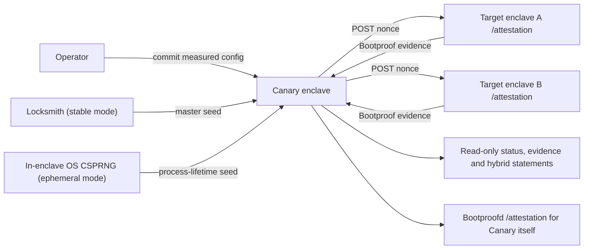

# Caution Canary V0 — Plan and System Specification

Status: standalone V0 implementation baseline.

This document is normative for V0. If another design document conflicts with it,
this document wins for V0.

## 1. Outcome

Canary V0 is a small Rust service running inside a Caution enclave. It periodically
requests fresh Bootproof attestations from one or more configured Caution enclaves,
checks PCR0/1/2 against a static measured configuration, and publishes short-lived
statements signed with both Ed25519 and ML-DSA-65.

V0 should be useful as:

- A continuous check that an enrolled endpoint still presents the same measured code.
- A public, independently inspectable demo of Caution, Bootproof and StageX, with
  Locksmith optional when stable identity is required.
- A foundation for later customer approvals, independent reproducers and co-verifiers.

It is deliberately not a durable monitoring platform yet.

### 1.1 V0 scope

This V0 implements a small coherent Canary system:

- Continuous fresh-nonce evidence checks.
- `VERIFIED`, `FAILED`, `UNREACHABLE` and `STALE` semantics.
- Signed, expiring results with a future-compatible co-verifier envelope.
- An independently measurable Caution-hosted verifier.

It intentionally defers customer-approved source-release policies, signed Reproducer
input, application-traffic key binding, independent client/widget consumption,
multi-region verification and durable evidence. The optional external webhook watcher
does not expand the measured V0 service or its trust claim.

## 2. V0 decisions

| Area | V0 decision |
|---|---|
| Hosting | One Caution-hosted enclave |
| Implementation | Rust, built with digest-pinned StageX images |
| Target count | One Canary node may monitor multiple target endpoints |
| Configuration | Static `canary.json`, embedded in the measured image |
| Attestation | Standard Bootproof HTTP API and `bootproof-sdk`; no direct NSM/Nitro driver calls |
| Expected PCR enrollment | Independently verified PCRs preferred; explicit TOFU capture allowed for the POC |
| Claim | One fixed, narrowly scoped V0 claim |
| Signatures | One Caution signer producing required Ed25519 + ML-DSA-65 signatures |
| Secret material | Stable: one random Locksmith-injected master seed. Ephemeral: one fresh process-local CSPRNG seed. Both use the same domain-separated child-key derivation |
| Storage | Enclave-local SQLite under `/tmp`; wiped on enclave restart |
| API | Public read-only status, evidence, config and key endpoints |
| Alerts | None inside `canaryd`; an optional external watcher may consume verified results |
| Timestamping | No OpenTimestamps or pre-quantum ceremony |
| Policy updates | Edit config, commit, deploy a new measured Canary image |

## 3. Exact trust claim

The only claim type is:

```text
caution.canary.pcr-match.v0
```

A `VERIFIED` result means:

> At `observed_at`, this Canary obtained a valid, fresh, nonce-bound AWS Nitro
> attestation from `target_origin`, and PCR0, PCR1 and PCR2 exactly matched the
> expected values embedded in the Canary configuration identified by
> `config_digest`.

It does not mean:

- The expected PCRs were independently reproduced from source.
- Normal application traffic reached the same enclave that answered `/attestation`.
- Every replica behind a load balancer was checked.
- The enclave remained unchanged between observations.
- The measured application is correct, safe or healthy.
- The history survived a Canary restart.

The statement is hybrid post-quantum signed, not “quantum-proof.” Nitro attestation
currently relies on a classical AWS-rooted ES384 chain, so the upstream evidence is
not post-quantum.

## 4. Enrollment and TOFU boundary

### Preferred enrollment

The customer first reproduces and verifies the target and saves its verified PCRs:

```sh
caution verify \
  --attestation-url https://payments.example.com/attestation \
  --save-pcrs
```

The resulting `.caution/trusted_hashes.json` is imported with
`canaryctl deployment add --pcrs`. This gives the strongest V0 workflow: the baseline
is tied to an independently reproduced source tree before Canary monitors its
continuity.

### Fast POC enrollment

`canaryctl deployment add --tofu` may challenge the live target, extract candidate
PCR0/1/2 from the signed document, validate its chain/signature/nonce using those
candidate values, display them, require explicit confirmation, and write them to
`canary.json`.

This is **trust on first use (TOFU)**. It proves only:

> Future observations continue to match the exact values explicitly enrolled from
> the live endpoint.

It does **not** prove that the captured values correspond to reviewed or independently
reproduced source. The CLI and README must label this limitation before confirmation;
the non-interactive override, if implemented, must be named `--accept-tofu`.

Canary never silently learns or updates expected PCRs during normal probes. The live
Bootproof manifest is never treated as policy.

## 5. Architecture



### 5.1 Components

`canaryd` runs inside the enclave and owns:

- Static config validation and digesting.
- Stable-seed loading or ephemeral-seed generation and child-key derivation.
- Bootproof target probes and verification.
- State calculation and statement signing.
- Ephemeral SQLite observations.
- A small JSON API and server-rendered status page.
- Writing `/metadata.json` for Canary's own Bootproof attestation.

`canaryctl` runs outside the enclave and owns:

- Creating and validating `canary.json`.
- Explicit TOFU deployment enrollment.
- Generating a random stable master seed for later Locksmith encryption.
- Enrolling a deployed Canary's attestation, config and key bindings.
- Verifying signed statements and evidence bundles offline.
- Optionally polling those verified results and delivering per-target webhooks from
  a separate, unmeasured watcher configuration.

Caution/Bootproof owns Canary's public `POST /attestation`. `canaryd` must not
implement or proxy that endpoint itself. The status surface may check whether
`/dev/nsm` exists to choose enclave/non-enclave guidance, but it must label that as
an untrusted local hint and must not open NSM or generate attestation documents.

### 5.2 Multiple targets

One Canary node may monitor multiple targets. Each target has its own probe state,
evidence and signed statement. The HTML page and `/status.json` may aggregate them,
but no aggregate result replaces the per-target statement.

If one URL load-balances several replicas, V0 observes only whichever replica answers.
To claim coverage of multiple replicas, each replica must have a distinct configured
attestation endpoint.

## 6. Measured configuration

The repository contains one canonical `canary.json`:

```json
{
  "version": 0,
  "node_id": "caution-canary-demo",
  "probe_interval_seconds": 60,
  "history_limit": 1000,
  "targets": [
    {
      "id": "payments-prod",
      "name": "Payments production",
      "attestation_url": "https://payments.example.com/attestation",
      "expected_pcrs": {
        "0": "<96 lowercase hex characters>",
        "1": "<96 lowercase hex characters>",
        "2": "<96 lowercase hex characters>"
      }
    }
  ]
}
```

Rules:

- `version` is exactly `0`.
- `node_id` and target IDs are unique, stable ASCII identifiers.
- At least one target is required; a practical V0 limit of 100 targets is sufficient.
- URLs are absolute HTTPS URLs without credentials or fragments.
- PCR0/1/2 are present, SHA-384-sized, canonical lowercase hex and nonzero.
- Unknown fields are rejected so misspellings do not silently weaken policy.
- `probe_interval_seconds` is global, defaults to 60, and is in 6–86,400.
- `history_limit` is per target, defaults to 1,000, and is in 1–10,000.
- Statement/result TTL remains fixed at 180 seconds. Longer probe intervals may
  intentionally produce `STALE` periods between observations.

`config_digest` is `sha256:` followed by the lowercase SHA-256 digest of RFC 8785
canonical JSON for the parsed configuration. The exact committed config is copied
into the image with a normalized file mode and is therefore part of the Canary
measurement.

There is no management API, live reload, customer approval object or policy database.
A config change requires a commit and a new Caution deployment with a new measurement.

## 7. Bootproof-only attestation

### 7.1 Target probe

For each target, at the configured global probe interval, `canaryd`:

1. Generates a fresh 32-byte nonce from the operating system CSPRNG.
2. Sends this standard Bootproof request:

   ```http
   POST /attestation
   Content-Type: application/json

   {"nonce":"<standard-base64>"}
   ```

3. Accepts the current Bootproof response shape:

   ```json
   {"document":"<standard-base64 COSE_Sign1>","manifest":{}}
   ```

4. Decodes `document` and verifies it with the verifier side of `bootproof-sdk`,
   equivalent to `Nitro::new(document, expected_pcrs).verify(now, nonce)`.
5. Records the result and signs the new target statement.

The V0 evidence endpoint and offline verifier use this frozen bundle schema:

```json
{
  "protocol": "caution-canary-evidence-v0",
  "target_id": "payments-prod",
  "document": "<canonical padded standard-base64 COSE_Sign1>",
  "nonce": "<canonical padded standard-base64 32 bytes>",
  "observed_at": "2026-07-17T12:00:00Z",
  "evidence_digest": "sha256:<decoded-document digest>",
  "manifest": {},
  "manifest_digest": "sha256:<RFC 8785 manifest digest>"
}
```

Unknown fields, non-canonical encodings, a non-32-byte nonce, and either digest
mismatch are rejected. Expected PCR0/1/2 are deliberately supplied separately and
never taken from the bundle. `observed_at` selects the certificate-validation time
for reproducible historical verification; the bundle alone does not prove that time
or its nonce was fresh. Freshness requires a separately trusted hybrid statement
binding the same `evidence_digest` and `observed_at`.

The SDK verification must cover the embedded AWS root chain, certificate validity,
COSE ES384 signature, exact nonce, and exact PCR0/1/2 equality. Config validation
rejects all-zero/debug PCR policies.

The sibling `manifest` is unsigned. V0 may record its digest for diagnostics, but it
must never use the manifest to establish expected PCRs or claim source provenance.

The raw bundle above remains frozen. A separate derived claims view may expose
observed PCR0/1/2, configured expected PCR0/1/2 and per-PCR equality. Observed values
must be omitted unless the AWS chain, COSE signature and challenge nonce were
authenticated against that same document. The derived view is diagnostic JSON, is
not included in `evidence_digest`, and does not replace replaying the raw bundle.

### 7.2 No direct Nitro access

`canaryd` and `canaryctl` are verifier/consumer applications. Their source must not:

- Import `aws-nitro-enclaves-nsm-api`.
- Open `/dev/nsm`.
- Send NSM ioctl requests.
- Generate Nitro attestations directly.

The deployed Caution Bootproof service is the only component that talks to NSM for
Canary's own attestation. The implementation should use verifier-only Bootproof
dependencies/features where available.

### 7.3 Canary's own attested metadata

After deriving its signing keys, `canaryd` writes `/metadata.json` atomically before
reporting ready. Bootproofd embeds it in the signed Nitro `user_data`:

```json
{
  "protocol": "caution-canary-v0",
  "node_id": "caution-canary-demo",
  "config_digest": "sha256:...",
  "keyset_digest": "sha256:...",
  "key_epoch": 0,
  "identity_mode": "stable"
}
```

`identity_mode` is exactly `stable` or `ephemeral` and binds the claimed signing-key
lifecycle into the fresh attestation. `keyset_digest` binds the canonical `/keys.json`
document. The full ML-DSA-65 public
key is intentionally served from `/keys.json` rather than placed in Nitro `user_data`;
the digest keeps the attested metadata small.

The config is measured because it is in the image. The secret-derived public keys are
not image measurements; they are runtime-bound to that measured enclave by signed
`user_data`. A verifier must check both links:

1. Independently verify the Canary measurement, normally with `caution verify`.
2. Verify a fresh Canary Bootproof attestation and its nonce against those expected
   PCRs.
3. Hash the canonical `config` member of `/config.json` and the canonical
   `/keys.json` document, then compare both attested digests.

`canaryctl enroll --pcrs <verified-canary-pcrs> --keys <path>` automates
steps 2 and 3 and atomically saves the exact key document whose digest it verified.
Its normal mode requires `--pcrs`, performs independent measurement
verification, and accepts only an HTTPS Canary origin.

`canaryctl verify` must require that separately enrolled key document through `--keys`.
After verifying the live node as described above, it must require the live canonical
`/keys.json` bytes to equal the pinned file before using the keys for either signature.
This makes key continuity and rotation explicit;
`enroll` is the only enrollment operation and never overwrites an existing pin.

`canaryctl verify` verifies each selected target's current published signed claim; it
does not claim to verify the latest network attempt. A fresh definitive claim may
remain current after a later transport failure. Its `--verbose` output must show the
command start time and, per target, the signed `observed_at`, `issued_at` and
`expires_at` timestamps. `verify --attempt` is the operation for one exact retained
attempt. These timestamps are signed Canary freshness fields, not an external
timestamp-authority proof. Multiple selected targets are independently fetched and
checked; the command must not imply an atomic aggregate snapshot.

Current and `--attempt` verification must present PCR claims only when
`verify_evidence` produced authenticated claims after validating the AWS chain, COSE
signature and nonce. Normal output shows compact authenticated observed PCR0/1/2 and
their match result; a mismatch shows the complete observed and expected values.
`--verbose` always shows the complete observed value, expected value and result for
each PCR.

JSON output retains `schema_version: 1` and all existing fields. Each deployment adds:

```json
{
  "pcrs": {
    "evidence_authentication": "verified",
    "observed": {"0": "...", "1": "...", "2": "..."},
    "expected": {"0": "...", "1": "...", "2": "..."},
    "matches": {"0": true, "1": true, "2": true}
  }
}
```

`pcrs` is `null` when authenticated evidence claims are unavailable. Signature,
certificate-chain or nonce failures must state that authenticated PCRs are
unavailable. Output must never substitute values decoded only from raw evidence, the
unsigned manifest or configuration. These are CLI presentation requirements and do
not change any signed or HTTP protocol format.

The live report must distinguish:

- attested Canary identity from development/TOFU signer continuity;
- measured and attested configuration from self-consistent but unauthenticated config;
- both required statement signatures from the statement/config and
  statement/evidence bindings;
- replay at the signed observation time from statement freshness at the live check
  time; and
- an aggregated Nitro/nonce/PCR result from unsupported fictional per-subcheck
  results.

An attested all-target success must identify the attested Canary trust input. An
insecure success must instead say that it verified against a TOFU signer and
unauthenticated config. Negative signed results and incomplete verification chains
exit nonzero.

For out-of-Caution test/demo deployments only, `enroll --insecure` and
`verify --insecure` may accept an HTTP origin and must skip Canary attestation
entirely. They validate the served config digest, canonical key document, shared node
identity and must warn that Canary workload identity is not established.
`enroll --insecure` saves an explicit TOFU key pin; `verify --insecure` and
`verify --attempt --insecure` require exact equality with that operator-provided
`--keys` pin before validating target statements and evidence. Initial key enrollment
remains TOFU. Target Nitro evidence is still replayed against PCR0/1/2 from the served
config, but those expected PCRs are not an independently authenticated policy in this
mode. `artifact verify-evidence` provides no insecure mode.

## 8. Signing and key management

### 8.1 Identity modes and master seed

Canary supports exactly two mutually exclusive signing-identity modes. Stable mode is
the default and requires Locksmith to inject exactly one environment variable:

```hcl
CANARY_MASTER_SEED = env::vault("CANARY_MASTER_SEED")
```

It is a unique, uniformly random 32-byte value encoded as base64. It must never be
committed, logged, returned by an API or reused for another Canary identity.

`canaryctl identity create` creates it from the operating system CSPRNG for later
Locksmith encryption.

Ephemeral mode is selected only with the measured daemon argument:

```text
canaryd --ephemeral-identity
```

It must fail startup if `CANARY_MASTER_SEED` is also present. On every `canaryd`
process start, it generates a fresh uniformly random 32-byte master seed through the
OS CSPRNG inside the process, derives the normal V0 child keys, zeroizes the temporary
seed and never serializes or persists private material. Entropy failure is fatal.
Ephemeral mode does not call NSM directly; fresh external Bootproof verification of
PCR0/1/2 and the signed metadata is what establishes that the current keyset belongs
to the expected measured enclave workload.

### 8.2 Deterministic child keys

Use HKDF-SHA-256 with domain-separated, versioned context:

```text
PRK = HKDF-Extract(
  salt = "caution-canary-v0/root",
  IKM  = decoded_master_seed
)

ed_seed = HKDF-Expand(
  PRK,
  "signing/ed25519/<node_id>/key-epoch-0",
  32
)

ml_seed = HKDF-Expand(
  PRK,
  "signing/ml-dsa-65/<node_id>/key-epoch-0",
  32
)
```

Derive Ed25519 from `ed_seed` and use the deterministic ML-DSA-65 key generation
interface with `ml_seed`. Pin the crypto implementation in `Cargo.lock` and include
known-answer tests. Zeroize the master seed, PRK, child seeds and private-key buffers
where the libraries permit it.

This construction is suitable for V0 if the master seed is unique and random. Its
trade-off is explicit: compromise of the one seed compromises both algorithms.
Hybrid signatures protect against a future algorithmic break; they do not protect
against extraction of the shared root secret.

The Locksmith seed persists across redeployments, so stable signer identity remains
unchanged when config changes. Ephemeral identity intentionally changes on every
process start. `key_epoch` remains `0` in both modes because it identifies the V0 key
profile, not a monotonic restart counter; the attested `identity_mode` and exact
`keyset_digest` make the lifecycle and current keyset explicit. Managed stable-key
rotation remains post-V0.

### 8.3 Public key set

`/keys.json` returns a canonical document such as:

```json
{
  "protocol": "caution-canary-v0",
  "node_id": "caution-canary-demo",
  "key_epoch": 0,
  "keys": [
    {"alg":"Ed25519","encoding":"base64url","public_key":"..."},
    {"alg":"ML-DSA-65","encoding":"base64url","public_key":"..."}
  ]
}
```

All base64url values omit padding.

## 9. Signed statement format

The payload is RFC 8785 canonical JSON. Both signatures cover the exact same bytes:

```text
"caution.canary.statement.v0\0" || canonical_payload
```

`target_origin` is the canonical serialized HTTPS origin derived from the configured
attestation URL: lowercase/IDNA-normalized host, omitted default port, and no path,
query, fragment, credentials or trailing slash.

Envelope:

```json
{
  "payload": {
    "claim_type": "caution.canary.pcr-match.v0",
    "target_id": "payments-prod",
    "target_origin": "https://payments.example.com",
    "status": "VERIFIED",
    "reason": "ALL_CHECKS_PASSED",
    "config_digest": "sha256:...",
    "evidence_digest": "sha256:...",
    "observed_at": "2026-07-17T12:00:00Z",
    "issued_at": "2026-07-17T12:00:00Z",
    "expires_at": "2026-07-17T12:03:00Z",
    "verifier_id": "caution-canary-demo",
    "key_epoch": 0
  },
  "signers": [
    {
      "verifier_id": "caution-canary-demo",
      "key_epoch": 0,
      "signatures": [
        {"alg":"Ed25519","sig":"<base64url>"},
        {"alg":"ML-DSA-65","sig":"<base64url>"}
      ]
    }
  ]
}
```

V0 verification requires both signatures from the one attested Caution signer. The
array shape permits future co-verifiers without changing the signed payload format.
No customer approval signature is required in V0.

For non-`VERIFIED` states, the same payload reports a negative or inconclusive result;
it does not assert that the PCR-match claim succeeded. `evidence_digest` is null when
no attestation document bytes could be decoded, including a missing or invalid-base64
`document`; malformed decoded COSE bytes still have a digest.

For `VERIFIED` and `FAILED`, `expires_at` is the definitive observation time plus 180
seconds. A later transport error must not extend it. `evidence_digest` is the SHA-256
digest of the decoded COSE attestation document bytes.

For `PENDING`, `UNREACHABLE` and `STALE`, `observed_at` and `evidence_digest` are null
and `expires_at` is `issued_at` plus 180 seconds. These statements report current
Canary state; they do not assert receipt of target evidence.

Consumers reject statements at `expires_at` and later. They also reject an `issued_at`
more than 30 seconds in the future to bound clock-skew tolerance.

## 10. Probe outcomes and state

Probe reasons are stable machine-readable values, including:

- `ALL_CHECKS_PASSED`
- `PCR_MISMATCH`
- `DEBUG_OR_ZERO_PCR`
- `INVALID_CERTIFICATE_CHAIN`
- `INVALID_SIGNATURE`
- `NONCE_MISMATCH`
- `MALFORMED_EVIDENCE`
- `HTTP_ERROR`
- `TIMEOUT`
- `UNREACHABLE`
- `INTERNAL_ERROR`

Target states:

| State | Rule |
|---|---|
| `PENDING` | Process started and no probe has completed. |
| `VERIFIED` | A matching observation is younger than 180 seconds. A transport warning may coexist. |
| `FAILED` | The latest definitive observation is a validation failure younger than 180 seconds. |
| `UNREACHABLE` | At least three consecutive transport failures occurred and no matching observation remains fresh. |
| `STALE` | No matching observation remains fresh, but there is no definitive evidence failure or persistent transport outage. |

A reachable invalid response changes state to `FAILED` immediately. One successful
probe recovers immediately; there is no two-success recovery rule in V0. A transport
failure does not erase a still-fresh verified result, but it is exposed as a warning.

State precedence is fresh definitive failure, fresh definitive success, persistent
transport outage, then stale. This makes failures immediate without preserving an old
failure forever after all evidence has expired.

On process or enclave restart, all targets begin `PENDING` and are probed immediately.

## 11. Network safety

Even though targets are measured static configuration, the HTTP client must:

- Allow HTTPS only in deployed V0.
- Reject URL credentials, fragments and redirects.
- Apply connect, total-request and response-size limits.
- Resolve DNS for every probe and reject loopback, private, link-local, multicast,
  unspecified and cloud-metadata destinations.
- Pin the approved resolved address for the connection to prevent DNS rebinding.
- Limit concurrency and add small randomized scheduling jitter.

Current Caution egress is a boolean gate: it permits or denies outbound access but
does not restrict it to Canary target origins. For V0, the target restriction is
therefore Canary application-enforced by this section's measured configuration, URL
validation, resolver policy and address pinning. This leaves residual risk if the host
or Caution platform is compromised and can bypass or replace the application-level
controls. Remove this caveat only after Caution supplies target-aware egress policy
that is mechanically bound to the measured Canary configuration and verified at
deployment.

## 12. Ephemeral SQLite

`canaryd` creates `/tmp/canary/canary.sqlite3` at startup. It stores only observations
from the current enclave lifetime:

- Target ID, attempt and observation timestamps.
- State, stable reason and latency.
- Evidence, evidence digest and challenge nonce when a response exists.
- Separately derived observed/expected PCR claims only after evidence authentication.
- Diagnostic manifest digest.
- Config digest and signed statement.

Schema migrations live in the Rust workspace and are embedded with
`sqlx::migrate!()`. Startup applies them before the service becomes ready. Migration
tests create an empty database and upgrade it to the current schema.

There is no PostgreSQL, external volume, replication or backup. Restarting the enclave
wipes history by design. SQLite supports only the current status page, recent history
and demo evidence inspection; it is not a durable audit log.

Each target retains and returns at most the measured `history_limit` most recent
attempts; the default is 1,000. Pruning is per target and transactional with the new
attempt and current-state update.

Raw evidence and its nonce may be returned by the evidence endpoint so a third party
can re-run verification. They are not secrets, but the response must document that a
Nitro attestation exposes infrastructure metadata.

## 13. HTTP interface

All V0 application endpoints are read-only and public. The deployment therefore
assumes target names, URLs, PCRs, public keys and attestation evidence are public.

| Route | Owner | Purpose |
|---|---|---|
| `GET /` | `canaryd` | Guided server-rendered multi-target status and verification page |
| `GET /health` | `canaryd` | Liveness/readiness; ready only after keys, metadata, migrations and scheduler initialize |
| `GET /status.json` | `canaryd` | Current state summary, runtime-environment hint and executable digest |
| `GET /targets/{id}/statement` | `canaryd` | Latest hybrid-signed statement |
| `GET /targets/{id}/evidence` | `canaryd` | Latest raw Bootproof evidence bundle and digest |
| `GET /targets/{id}/evidence/claims` | `canaryd` | Versioned derived view of authenticated observed PCR0/1/2, configured policy and match results |
| `GET /targets/{id}/history` | `canaryd` | Bounded current-lifetime observation history |
| `GET /targets/{id}/history/{attempt_id}` | `canaryd` | Exact retained statement and evidence for one attempt |
| `GET /targets/{id}/history/{attempt_id}/evidence/claims` | `canaryd` | Versioned derived PCR claims for one retained attempt |
| `GET /config.json` | `canaryd` | `{ "config": <canonical config>, "config_digest": "sha256:..." }` |
| `GET /keys.json` | `canaryd` | Canonical hybrid public key set |
| `POST /attestation` | Caution Bootproofd | Fresh attestation for the Canary enclave itself |

There are no create/update/delete, manual-probe, authentication, webhook or admin
routes in V0.

`status.json.runtime.environment` is `nitro_enclave` when `/dev/nsm` exists and
`non_enclave` otherwise. The page must condition its ready-to-copy verification
workflow on this server-side value, never on HTTP versus HTTPS. The value is
self-reported and does not prove enclave execution.

`status.json.runtime.binary_digest` is `sha256:` plus the SHA-256 of the executable
resolved by `current_exe()` at startup. It identifies the exact daemon bytes for
correlation, but it is also self-reported and does not replace independently
reproduced Canary PCR0/1/2 or fresh node attestation.

When the server reports `nitro_enclave`, the page may offer a browser evidence check.
It must start as `NOT RUN`, make no `POST /attestation` request on page load, and run
only after explicit user action. The check challenges `POST /attestation` with a
fresh browser-generated nonce and uses same-origin JavaScript to check certificate
signatures to the pinned AWS Nitro root, certificate dates, COSE ES384 and the nonce
before displaying observed Canary PCR0/1/2 as `EVIDENCE CHECKED`. It must disclose
that this convenience check does not perform the full X.509 policy validation used
by `canaryctl`, that expected Canary PCR policy was not independently checked, and
that the page and JavaScript come from the same origin. It does not replace
`canaryctl enroll` with operator-supplied Canary PCRs.

History-list fields are unsigned diagnostics. The detail route returns the exact
signed post-attempt statement and, when the response contained decodable attestation
document bytes, the exact nonce-bound evidence bundle stored for that attempt.
Authenticated observed/expected PCR claims are returned by the sibling
`/evidence/claims` route when verification produced them; they never modify the raw
evidence bundle or its historical replay envelope. A consumer can authenticate and
replay those artifacts; transport failures and undecodable responses necessarily
have no target evidence to replay. Historical statement freshness is evaluated at
its signed issuance time and must not be presented as current freshness.

## 14. StageX build and Caution deployment

### 14.1 Rust workspace

Planned layout:

```text
Cargo.toml
Cargo.lock
crates/canary-core/
crates/canaryd/
crates/canaryctl/
migrations/
canary.json
Containerfile
caution.hcl
```

`canary-core` contains schemas, canonicalization, key derivation, statement signing
and verification, and Bootproof evidence verification shared by both binaries.

### 14.2 Reproducible image

The root `Containerfile` must:

- Pin `stagex/pallet-rust` and `stagex/core-filesystem` by verified SHA-256 digest.
- Commit `Cargo.lock`; run `cargo fetch --locked`, then a `cargo build --frozen`
  compile step with `RUN --network=none`.
- Build static musl binaries with `CARGO_INCREMENTAL=0`, one codegen unit, stripped
  output, fixed `SOURCE_DATE_EPOCH`, and remapped source paths.
- Use pinned Rust dependencies for TLS roots and bundled SQLite; require no dynamic
  runtime libraries.
- Normalize modes for `canary.json`, optional Locksmith files and binaries inside a build
  stage, then `COPY --from=`. Do not use final-path `COPY --chmod`.
- Use the minimal StageX filesystem so `/tmp` exists and is writable.
- Override the StageX shell entrypoint with `/app/canaryd`.
- Include `/etc/caution/bundle.json` and `/etc/caution/secrets/*.asc` together when
  stable mode uses `env::vault`; require neither in ephemeral mode.

Two clean OCI builds must compare byte-for-byte when exported with normalized
timestamps. The deployed image must also pass `caution verify`.

### 14.3 `caution.hcl`

The root config uses:

- One enclave and the required `unit "default"` running `/app/canaryd`.
- The full `containerfile` image; no `build.binary`, so measured config and optional
  Locksmith files are preserved.
- Exactly one identity selection: stable mode uses
  `CANARY_MASTER_SEED = env::vault("CANARY_MASTER_SEED")`; ephemeral mode uses
  `args = ["--ephemeral-identity"]` and no `env::vault`.
- Public application HTTP ingress on the `canaryd` port.
- A broad TCP/443 egress rule enables Caution's current boolean egress gate; Caution
  does not enforce the rule's destination or port. Target restriction is Canary
  application-enforced in V0, which does not protect against host/platform compromise.
  Replace this qualification only when target-aware Caution egress policy is
  mechanically bound to and verified against the measured configuration.
- `app_sources` pointing to the public source repository.
- No debug block in the showcase deployment.

Deployment is `git push caution main`; there is no invented deploy subcommand.

## 15. Bootstrap example

This is the intended end-to-end V0 flow; exact command help remains the source of truth
as the CLIs are implemented.

```sh
# 1. Preferred: reproduce the target and save the verified PCRs.
caution verify \
  --attestation-url https://payments.example.com/attestation \
  --save-pcrs

# 2a. Add the independently verified values.
canaryctl deployment add \
  --config canary.json \
  --canary-id caution-canary-demo \
  --id payments-prod \
  --name "Payments production" \
  --url https://payments.example.com/attestation \
  --pcrs .caution/trusted_hashes.json

# 2b. Or, for the fast POC path only, enroll a TOFU baseline.
canaryctl deployment add \
  --config canary.json \
  --canary-id caution-canary-demo \
  --id payments-prod \
  --name "Payments production" \
  --url https://payments.example.com/attestation \
  --tofu

# Repeat 2a or 2b with another unique ID to monitor another enclave.

# 3a. Easiest Caution demo: set the measured daemon argument in caution.hcl.
#     Do not configure env::vault or package Locksmith artifacts.
# args = ["--ephemeral-identity"]

# 3b. Or provision a stable identity. Generate the root seed locally.
#     Never commit .env.
canaryctl identity create --env-file .env

# 4. Stable mode only: POC-only 1-of-1 Locksmith setup.
caution secret keygen canary.asc \
  --name "Canary POC" --email canary@example.com --shoot-self-in-foot
export KEYMAKER_URL=https://<keymaker-host>
caution secret new canary.asc --threshold 1 --max 1
caution secret encrypt --env-file .env CANARY_MASTER_SEED

# 5. Initialize, commit public/measured inputs and encrypted secret material, deploy.
caution init
git push caution main

# Reproduce the Canary and save its trusted hashes.
caution verify --save-pcrs
# Stable mode only: release the seed. Ephemeral mode is already running.
caution secret send-shard --keyring canary.private.asc

# 6. Attest the Canary once and enroll its exact public signing keys.
canaryctl enroll \
  --url https://<canary-host> \
  --pcrs .caution/trusted_hashes.json \
  --keys canary-keys.json

# 7. Re-attest the Canary and verify every current target claim end to end,
# requiring the independently enrolled keyset as well as the Canary PCRs.
canaryctl verify \
  --url https://<canary-host> \
  --pcrs .caution/trusted_hashes.json \
  --keys canary-keys.json

# Lower-level/offline equivalents remain available.
curl -fsS https://<canary-host>/targets/payments-prod/statement -o statement.json
canaryctl artifact verify-statement \
  --statement statement.json \
  --keys canary-keys.json
```

Never commit `.env` or the unencrypted private keyring. Both modes commit
`.caution/deployment.json`, `canary.json`, `Containerfile`, `caution.hcl` and
`Cargo.lock`. Stable mode additionally commits `.caution/quorum-bundle.json` and the
encrypted `.caution/secrets/`; ephemeral mode requires neither.

## 16. V0 implementation phases

### Phase 1 — Offline trust core

- Create the Rust workspace and StageX build skeleton.
- Define strict config, keyset, evidence and statement schemas.
- Implement canonical JSON digests and fixed claim semantics.
- Implement master-seed parsing, HKDF child derivation and both signature algorithms.
- Implement hybrid statement sign/verify with deterministic test vectors.
- Implement `canaryctl deployment add`, `identity create` and offline verification.

Exit: config and statements round-trip reproducibly; replayed/wrong-nonce and either
missing/invalid signature fail tests.

### Phase 2 — Working monitor

- Implement the hardened Bootproof HTTP client and SDK verification.
- Implement the state machine, scheduler, jitter and immediate startup probes.
- Add embedded SQLite migrations and bounded history.
- Add the read-only JSON API, evidence endpoint and minimal HTML page.
- Write attested metadata and add `enroll` digest checks.

Exit: one local process monitors multiple fixtures/targets independently and exposes
verifiable evidence and hybrid statements.

### Phase 3 — Usable Caution enclave POC

- Finish the digest-pinned StageX Containerfile and `caution.hcl`.
- Support both a Locksmith-backed stable identity and an explicitly selected
  Locksmith-free ephemeral identity in the same reproducible build recipe.
- Deploy one Canary monitoring at least two distinct Caution target endpoints.
- Run `caution verify` for the Canary and preferred-flow targets.
- Demonstrate TOFU enrollment separately and visibly label its weaker guarantee.
- Run restart, mismatch, nonce replay, outage, expiry and recovery scenarios.
- Publish a concise demo script using only README commands.

Exit: a new evaluator can bootstrap the node, inspect its measured config and attested
key binding, observe live per-target state, download evidence, and verify both
signatures without access to Caution internals.

## 17. Acceptance criteria

1. One Canary enclave monitors at least two targets without combining their claims.
2. A valid fresh Bootproof document matching PCR0/1/2 produces `VERIFIED`.
3. A replayed document or wrong nonce is rejected and cannot produce `VERIFIED`.
4. A PCR, certificate, signature or evidence-format failure produces `FAILED`
   immediately.
5. Transport failure remains distinct, preserves a still-fresh success, and becomes
   `UNREACHABLE` only after three consecutive failures and TTL expiry.
6. One later valid probe recovers immediately.
7. A consumer rejects an expired statement or a statement missing either Ed25519 or
   ML-DSA-65 verification.
8. A fresh Canary attestation binds the measured config digest and the served keyset
   digest; absent or mismatched metadata is rejected.
9. A config edit requires redeployment and changes the Canary measurement/config
   digest. Stable mode retains the Locksmith-derived signer; ephemeral mode produces a
   new signer at the next process start.
10. Enclave restart wipes SQLite history, returns targets to `PENDING`, triggers
    immediate probes, and causes an old ephemeral key pin to fail closed.
11. SSRF tests reject prohibited addresses, redirects, oversized bodies and DNS
    rebinding.
12. Source and dependency review finds no direct NSM/Nitro attestation-generation
    call in Canary code.
13. Two normalized clean StageX builds match and the deployed Canary passes
    `caution verify`.
14. README and CLI confirmation explicitly call live PCR capture TOFU and make no
    source-reproduction claim.
15. The UI lists monitored deployments before independent verification guidance and
    Canary runtime details, provides concise local verification commands, and retains
    raw protocol artifacts as secondary links.
16. The Nitro browser evidence check starts idle, performs no request until explicit
    user action, and labels a successful convenience check `EVIDENCE CHECKED`.
17. Fresh signed node metadata labels `identity_mode`; ephemeral startup rejects a
    simultaneous `CANARY_MASTER_SEED`, generates distinct keysets across starts and
    requires no Locksmith artifacts or shard release.

## 18. Explicit non-goals and upgrade path

Not in V0:

- PostgreSQL, external persistence or a durable transparency log.
- OpenTimestamps or proof that the node existed before a future cryptographic break.
- Webhooks, alert routing or a webhook secret inside `canaryd` or measured
  `canary.json`.
- Customer approval/countersignature flows.
- Multiple independent verifiers or quorum evaluation.
- Live config reload or mutable policy management APIs.
- Application-traffic binding, enforcement or remediation.
- Automatic replica discovery.

Likely next steps, only after V0 is demonstrated:

1. Add signed independent reproduction statements and distinguish continuity from
   source reproduction.
2. Add customer approval and co-verifier signer objects only when their semantics and
   operational ownership are clear.
3. Add durable external storage or a transparency log if audit retention becomes a
   real requirement.
4. Add replica discovery and independently consumed traffic-path claims.

OpenTimestamps is intentionally deferred. It becomes useful only if V0 later makes a
specific historical claim whose value exceeds the cost of operating and explaining a
timestamping ceremony. It adds no useful assurance to the current continuity claim.
