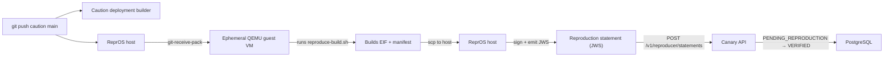

# Reproducer Architecture — ReprOS-backed

Status: design / post-V0. Canary V0 (`canary-v0-spec.md`) does not change the
Reproducer and accepts customer-supplied signed statements. This document
specifies the future hosted Reproducer Caution will build using
[ReprOS](https://codeberg.org/stagex/repros) as the isolated build backend.

## Goal

When a customer runs `git push caution main`, Caution starts two independent
builds in parallel: the **deployment build** (produces the enclave image that
runs) and the **reproduction build** (independently builds the same immutable
source commit and pinned inputs, then signs a reproduction statement). The
reproduction build runs on ReprOS so the build environment itself is
deterministic, minimal, and isolated from Caution's deployment infrastructure.

This satisfies the independence requirement in the product brief: reproduction
runs on separate infrastructure and credentials, fetches the immutable commit
itself, and uses pinned build inputs.

## Why ReprOS

ReprOS is a deterministic, minimal, immutable Linux distribution designed
specifically for reproducing container builds. It operates as a standalone
git remote: a `git push` triggers a one-time-use QEMU VM that runs the build
command, hashes outputs, and signs them with a key held on the host.

Properties that make it suitable as the Reproducer backend:

- **Ephemeral isolation**: each reproduction gets a fresh VM; no state leaks
  between builds.
- **Minimal attack surface**: the host exposes only OpenSSH, Git, and QEMU.
  Build commands run inside the guest with no network egress except what NAT
  allows (and can be restricted).
- **Deterministic outputs**: epoch-zeroed file timestamps, `cpio --reproducible`,
  digest-pinned StageX pallets, and `make reproduce` bit-for-bit verification.
- **Hardware signing**: the signing key lives on the host's `CONFIG` partition
  (or an attached smartcard per ReprOS upstream design), not in the build VM.
- **Git-native interface**: no custom API to integrate — Caution pushes to
  ReprOS exactly as any CI system would.

## What ReprOS does NOT provide

ReprOS was designed for signing arbitrary artifact files, not for producing
enclave measurements or Canary-format statements. The gaps that the adapter
layer must fill:

1. **No structured reproduction statement.** ReprOS signs artifact files with
   `ssh-keygen -Y sign` and pushes `.sig` files to a git repo. Canary needs a
   signed JWS reproduction statement (`reproduction-statement.md` format)
   containing PCRs, manifest digest, build provenance, and verifier identity.
2. **No measurement extraction.** ReprOS runs an arbitrary `build.command` and
   hashes its outputs. It does not build an EIF or extract Nitro PCRs. The
   build command must produce the EIF, and a post-build step must extract
   measurements and fold them into the statement.
3. **No callback to Canary.** ReprOS pushes signatures to a git storage repo
   for later merging. Canary needs the signed statement delivered back so it
   can transition the target from `PENDING_REPRODUCTION` to `VERIFIED` or
   `REPRODUCTION_MISMATCH`.
4. **Key format mismatch.** ReprOS uses an ed25519 SSH key for `ssh-keygen -Y
   sign`. Canary statements use a JWKS-published signing key with a `kid`. The
   adapter must either reconcile keys or produce the JWS inside the VM using a
   key whose public half is published to Canary's `/.well-known/jwks.json`.

## Architecture



## Components

### ReprOS host

A dedicated ReprOS node (or pool) operated by Caution, separate from the
deployment infrastructure. It holds:

- A signing key on the `CONFIG` partition whose public half is registered with
  Canary's JWKS endpoint as a reproducer key (not the same key Canary uses for
  status statements — reproduction and verification are deliberately separate
  principals).
- The customer's source pushed via `git push`.

### reproduce-build.sh

A Caution-provided build script that the customer's `.repros/config.yml`
invokes as `build.command`. It runs inside the guest VM and is responsible for:

1. Producing the enclave image (e.g., `caution build` → `out/app.eif`).
2. Computing the manifest digest (sha256 of the EIF).
3. Extracting expected PCRs (from the EIF or `caution verify --save-pcrs`).
4. Emitting an unsigned reproduction statement JSON containing:
   - Source commit (fetched independently, not from a pushed ref that could be
     rewritten)
   - Build inputs and their pinned digests
   - Manifest digest
   - Expected PCRs (PCR0, PCR1, PCR2)
   - Build provenance (ReprOS image digest, build timestamp, build command)
   - Verifier identity (`caution-reproducer-v1`)
5. Writing the statement to a well-known path (e.g., `out/reproduction-statement.json`).

The script does not sign anything — signing happens on the ReprOS host where
the key is held, not in the build VM.

### ReprOS signing adapter

A post-build step on the ReprOS host (invoked via a ReprOS `post-receive` hook
or a modified `.repros/config.yml` `storage` section) that:

1. scp's `out/reproduction-statement.json` from the guest.
2. Signs it as a JWS using the host's signing key (the same key registered in
   Canary's JWKS), producing a compact JWS with `kid`.
3. POSTs the signed statement to Canary's
   `POST /v1/reproducer/statements` endpoint.
4. Optionally also stores the statement in a git signatures repo for audit.

This adapter is Caution-specific glue; it is not part of upstream ReprOS. It
can be implemented as a wrapper around ReprOS's existing `sign.method: ssh`
flow by treating the statement JSON as the artifact to sign, then re-wrapping
the signature into a JWS before delivery to Canary.

### Canary API extension

New endpoint (post-V0, per the upgrade path in `canary-v0-spec.md:235`):

```
POST /v1/reproducer/statements
Content-Type: application/jws
```

Canary validates:
- JWS signature against registered reproducer JWKS keys.
- Statement freshness and nonce.
- Source commit matches an active `PENDING_REPRODUCTION` target.
- Manifest digest and PCRs against the target's approved release policy.

On match, the target transitions to `SOURCE_REPRODUCED` (distinct from
`PCR_POLICY_VERIFIED`, which V0 already handles). On mismatch, it transitions
to `REPRODUCTION_MISMATCH` and emits a webhook with reason code
`REPRODUCTION_MISMATCH`.

## Reproduction statement format

```json
{
  "iss": "https://reproducer.caution.co",
  "sub": "caution:target:app_01",
  "source_commit": "sha256:abc123...",
  "build_inputs": [
    { "name": "caution-base-image", "digest": "sha256:..." }
  ],
  "manifest_digest": "sha256:def456...",
  "expected_pcrs": {
    "0": "...",
    "1": "...",
    "2": "..."
  },
  "build_provenance": {
    "repros_image_digest": "sha256:...",
    "build_command": "caution build",
    "built_at": "2026-07-17T12:00:00Z"
  },
  "verifier_id": "caution-reproducer-v1",
  "observed_at": "2026-07-17T12:00:00Z",
  "exp": 1784299380
}
```

This extends the Canary status statement schema
(`canary-v0-spec.md:148-166`) with reproduction-specific fields. The envelope
supports multiple signatures from the beginning so multiple reproducers
(customer, auditor, independent) can co-sign without changing the format.

## `.repros/config.yml` for Caution reproduction

A customer repo that opts into Caution reproduction would include:

```yaml
build:
  command: ./reproduce-build.sh
sign:
  files:
    - out/reproduction-statement.json
  format: raw
  method: ssh
storage:
  method: git
  location: git@codeberg.org:caution/repros-sigs.git
  path: /<org>/<app>
```

Where `reproduce-build.sh` is provided by Caution (or referenced from a
Caution-owned base image) and produces both the EIF and the unsigned
reproduction statement. ReprOS's native `ssh-keygen -Y sign` flow signs the
statement file; the adapter re-wraps the result into a JWS before posting to
Canary.

## Key separation

| Principal | Key purpose | Where held | Published via |
|---|---|---|---|
| Canary status signer | Signs live status statements (`VERIFIED`, etc.) | Canary service | `/.well-known/jwks.json` |
| Reproducer signer | Signs reproduction statements | ReprOS host `CONFIG` partition | Canary-registered reproducer JWKS |
| Customer approver | Signs release policy authorizing a reproduced release | Customer-controlled | Canary policy store |

Reproduction and verification must never share a signing key. A compromised
Canary service must not be able to forge reproduction evidence, and a
compromised Reproducer must not be able to assert live verification status.

## Operational considerations

- **Capacity**: each reproduction spawns a QEMU VM with dedicated CPU and
  memory (host reserves ~8GB). A ReprOS node handles one reproduction at a time
  (enforced by `/home/git/repros.lock`). A pool is needed for parallel
  reproductions across customers.
- **Timeouts**: ReprOS waits up to 30s for guest SSH and up to 300s for guest
  Docker. Long builds need a higher timeout or a build-step timeout inside
  `reproduce-build.sh`.
- **Network egress**: the guest NATs through the host. For strict
  reproducibility, egress should be restricted to the minimum required (git
  fetch, image registry pulls of pinned digests). ReprOS does not enforce this
  by default.
- **ReprOS image pinning**: the ReprOS image itself must be reproducible and
  its digest recorded in `build_provenance.repros_image_digest`. Caution should
  run `make reproduce` against its own ReprOS releases and pin the verified
  digest.
- **Guest kernel**: the guest kernel comes from the `stagex/linux-guest`
  pallet. Caution must pin and track this for security updates that could
  affect build determinism.

## Non-goals for this design

- **No automatic approval.** A successful reproduction does not authorize a
  release. Authorization comes from an explicit customer signature or release
  policy (per `canary-product-brief.md:56`).
- **No multi-reproducer quorum.** This design covers a single Caution-operated
  Reproducer. The statement format supports multiple signatures, but quorum
  enforcement is a later concern (per `canary-product-brief.md:58`).
- **No transparency log.** Statements are delivered directly to Canary and
  stored in PostgreSQL. Sigstore/Rekor integration is post-MVP per the product
  brief.
- **No changes to V0.** This is post-V0 work. V0 accepts customer-supplied
  signed statements and does not require a hosted Reproducer
  (`canary-v0-spec.md:5`, `canary-v0-spec.md:208`).

## References

- `canary-product-brief.md` — overall product, Reproducer relationship (§"Relationship to the Reproducer")
- `canary-v0-spec.md` — V0 scope, non-goals, upgrade path (§"Upgrade path", item 1)
- `../repros/AGENTS.md` — ReprOS architecture, build flow, conventions
- `../repros/README.md` — ReprOS usage, git push flow, `.repros/config.yml`